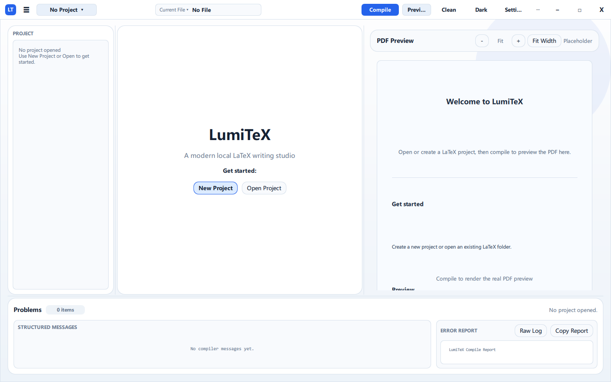

# LumiTeX

**LumiTeX** is a lightweight LaTeX editor, LaTeX compiler, and PDF preview tool for academic writing.
## Features

- Modern PySide6 + QML interface
- Chinese / English UI
- Light / dark themes
- Local LaTeX project management
- `.tex`, `.bib`, `.cls`, `.sty` editing
- Image preview and image import
- One-click LaTeX compilation
- `Ctrl + S` to save and compile
- Support for `xelatex`, `pdflatex`, and `latexmk`
- Multi-page PDF preview
- PDF zoom and fit-width mode
- Show / hide PDF preview panel
- Structured compile error report
- Clean LaTeX auxiliary files
- Basic LaTeX snippets, search, and syntax highlighting
- Template-based project creation

## Screenshots

Place screenshots under the `screenshots/` directory.

Example:





## Requirements

LumiTeX does **not** include a LaTeX distribution.

Please install one of the following first:

- MiKTeX
- TeX Live

Make sure these commands are available in your system PATH:

```bash
xelatex --version
pdflatex --version
bibtex --version
```

For `latexmk`, also check:

```bash
latexmk --version
```

## Installation

```bash
git clone https://github.com/Greyles/LumiTex.git
cd LumiTex
pip install -r requirements.txt
python main.py
```

## Dependencies

```text
PySide6
PyMuPDF
```

## Compilation Engines

| Engine | Use Case |
|---|---|
| `xelatex` | Unicode, Chinese documents, modern fonts |
| `pdflatex` | Traditional English LaTeX documents |
| `latexmk` | Automatic multi-pass compilation for citations and references |

Recommended default:

```text
xelatex
```

If citations appear as `[?]`, try `latexmk`.

## Usage

1. Click **New Project** or **Open**.
2. Edit your LaTeX files.
3. Press **Ctrl + S** to save and compile.
4. Preview the generated PDF.
5. Use **Clean** to remove auxiliary files.

## Windows Build

```bash
pip install -r requirements-dev.txt
build_windows.bat
```

The packaged app will be generated in:

```text
dist/LumiTeX/
```

LumiTeX does not package MiKTeX or TeX Live.

## Project Structure

```text
LumiTeX/
├── main.py
├── lumitex/
├── qml/
├── templates/
├── examples/
├── screenshots/
├── requirements.txt
└── README.md
```

## Limitations

- Basic syntax highlighting
- Simple LaTeX autocomplete
- No full BibTeX manager yet
- No PDF-source synchronization yet
- No built-in LaTeX distribution
- Large-file editing still needs optimization

## Roadmap

- Better LaTeX autocomplete
- BibTeX entry browser
- PDF-source synchronization
- More academic templates
- Git-based paper version management
- Better error diagnostics


